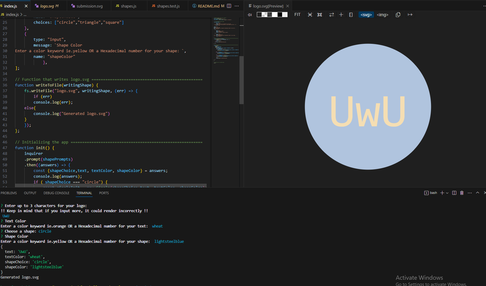

# SVG-Logo-Generator_10

  ## Table of Contents
- [Description](#description)
- [Installation](#installation)
- [Usage](#usage)
- [Credits](#credits)
- [License](#license)
- [Contributing](#contributing)
- [Tests](#tests)
- [Questions](#questions)

## Description 
This project was made to generate simple SVG logos without requiring a graphic designer to do so. Using Inquirer, prompts were able to be collected through the terminal. Jest was also learned to run tests on the rendering properties of the shapes defined in the shapes.js file. The polymorphism concept was also explored with classes and constructors. In turn, this allowed the creation of a parent class with children classes that shared the same function with different code content. SVG format was also learned and manipulated to fit the project's needs.

## Installation
Make sure you have the node modules in your local machine using the line **npm install** in the terminal. Then, run the command in the Usage section once this setup is complete and you have node_modules and a package-lock.json in your file directory.

## Usage
Usage Image:

With the terminal open run the line **node index.js** to get node to search the file and execute the code. Once node finishes loading, you will get a series of prompts. Answer the prompts, and once there are no more prompts you will be notified of the prompt completion in the terminal with the line **Generated logo.svg**. A logo.svg file will be generated for you to use. To see your generated logo you can open the file in your browser or use an svg extension/converter if you wish to do so. Also, feel free to refernce the pre-generated examples in the examples folder of the repo.

Link to Demo Video: https://drive.google.com/file/d/12A1XLzaDD9qc48opGTg0G0GbbA1M3paY/view?usp=sharing

## Credits
Video referenced for startup: https://youtu.be/m9oC3wo6JW4?si=trWAnYN4PeJZpcdu

## License
License: MIT

## Contributing 
Go to the Questions section for more info.

## Tests 
To run the tests that verify the render methods of the shapes, run the line **npm test** to run the shapes.test.js file. The test will then match if the render method coincicides with the passed in values such as color in the class constructor enclosed in the test.

## Questions 
If you have questions regarding the app, you can reach out to my github or email.

GitHub: https://github.com/Kanabaki

Email: kagomekanabaki@gmail.com

-Note- Some code was developed under the guidance of Torre Taylor such as the initialization of the Circle shape in the init function and also Tye Stanley with the correct rendering of the subsequent shape classes of that init function.
 -Note-